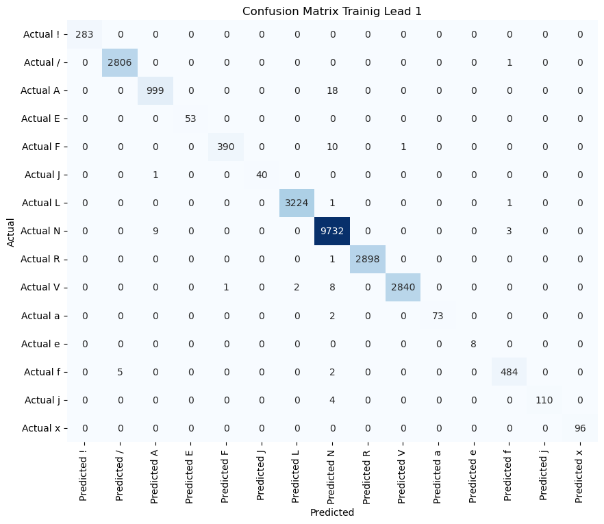
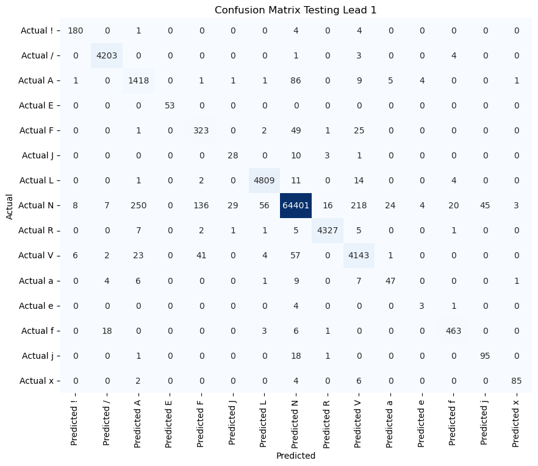

# Arrhythmia Detection using Electrocardiogram

## DataSets

- Find full form of annotation symbols [here](https://physionet.org/physiotools/wpg/wpg_36.htm).

| S.No. |                           Name                            |                                                #Records                                                | Record Length | #Patients |                  #Leads                   | #Sampling Frequency | Resolution |                  File Format                   |                                                                                                                                                                                                                  Annotaions Info                                                                                                                                                                                                                   |                                                                                                                                                                                                                                                                                                                                                                                                                                                                                                                                                                                                                                                                                                                                                                                                                                                                                                                                                                                                                                                                                                                                                                                                                                                                                                                                                                                                                                                                                                                                                                                                                                                                                                                                                                                                                                                                                                                                                                                                                                                                                                                                                                                                                                                                                                                                         Annotations Count                                                                                                                                                                                                                                                                                                                                                                                                                                                                                                                                                                                                                                                                                                                                                                                                                                                                                                                                                                                                                                                                                                                                                                                                                                                                                                                                                                                                                                                                                                                                                                                                                                                                                                                                                                                                                                                                                                                                                                                                                                                                                                                                                                                                                                                                                                                                         |                                            Link                                            |
| :---: | :-------------------------------------------------------: | :----------------------------------------------------------------------------------------------------: | :-----------: | :-------: | :---------------------------------------: | :-----------------: | :--------: | :--------------------------------------------: | :------------------------------------------------------------------------------------------------------------------------------------------------------------------------------------------------------------------------------------------------------------------------------------------------------------------------------------------------------------------------------------------------------------------------------------------------: | :-----------------------------------------------------------------------------------------------------------------------------------------------------------------------------------------------------------------------------------------------------------------------------------------------------------------------------------------------------------------------------------------------------------------------------------------------------------------------------------------------------------------------------------------------------------------------------------------------------------------------------------------------------------------------------------------------------------------------------------------------------------------------------------------------------------------------------------------------------------------------------------------------------------------------------------------------------------------------------------------------------------------------------------------------------------------------------------------------------------------------------------------------------------------------------------------------------------------------------------------------------------------------------------------------------------------------------------------------------------------------------------------------------------------------------------------------------------------------------------------------------------------------------------------------------------------------------------------------------------------------------------------------------------------------------------------------------------------------------------------------------------------------------------------------------------------------------------------------------------------------------------------------------------------------------------------------------------------------------------------------------------------------------------------------------------------------------------------------------------------------------------------------------------------------------------------------------------------------------------------------------------------------------------------------------------------------------------------------------------------------------------------------------------------------------------------------------------------------------------------------------------------------------------------------------------------------------------------------------------------------------------------------------------------------------------------------------------------------------------------------------------------------------------------------------------------------------------------------------------------------------------------------------------------------------------------------------------------------------------------------------------------------------------------------------------------------------------------------------------------------------------------------------------------------------------------------------------------------------------------------------------------------------------------------------------------------------------------------------------------------------------------------------------------------------------------------------------------------------------------------------------------------------------------------------------------------------------------------------------------------------------------------------------------------------------------------------------------------------------------------------------------------------------------------------------------------------------------------------------------------------------------------------------------------------------------------------------------------------------------------------------------------------------------------------------------------------------------------------------------------------------------------------------------------------------------------------------------------------------------------------------------------------------------------------------------------------------------------------------------------------------------------------------------------------------------------------------------------------------------------------------------------------------------------------------------------------------------------------------------------------------------------------------------------------------------------: | :----------------------------------------------------------------------------------------: |
|   1   |                MIT-BIH Arrhythmia Database                |                                                   48                                                   |    30 min     |    47     |                     2                     |   360 samples/sec   |   11 bit   |             .atr, .dat, .hea, .xws             |                                                                  <ol><li>Indices of R-peak.</li><li>Beat annotations at each R-peak.</li><li>Rhythm Annotations.</li></ol>  Find more info [here](https://archive.physionet.org/physiobank/database/html/mitdbdir/intro.htm#annotations) and [here](https://www.physionet.org/physiobank/database/html/mitdbdir/tables.htm).                                                                   |                                                                                                                                                                                                                                                                                                                                                                                                                                                                                                                                                                                                                                                                                                                                                                                                                                                 
<table><caption><strong>Beat Annotation</strong></caption><thead><tr><th>Annotation</th><th> Annotation Name</th><th>Count</th></tr></thead><tbody><tr><td>+</td><td>Rhythm change</td><td>1,296</td></tr><tr><td>N</td><td>Normal Beat</td><td>75,151</td></tr><tr><td>V</td><td>Premature ventricular contraction</td><td>7,134</td></tr><tr><td>F</td><td>Fusion of ventricular and normal beat</td><td>803</td></tr><tr><td>~</td><td>Change in signal quality</td><td>616</td></tr><tr><td>a</td><td>Aberrated atrial premature beat</td><td>150</td></tr><tr><td>\|</td><td>Isolated QRS-like artifact</td><td>132</td></tr><tr><td>E</td><td>Ventricular escape beat</td><td>106</td></tr><tr><td>A</td><td>Atrial premature beat</td><td>2,546</td></tr><tr><td>R</td><td>Right bundle branch block beat</td><td>7,259</td></tr><tr><td>x</td><td>Non-conducted P-wave (blocked APB)</td><td>193</td></tr><tr><td>/</td><td>Paced beat</td><td>9,056</td></tr><tr><td>f</td><td>Fusion of paced and normal beat</td><td>1,038</td></tr><tr><td>j</td><td>Nodal (junctional) escape beat</td><td>229</td></tr><tr><td>Q</td><td>Unclassifiable beat</td><td>33</td></tr><tr><td>L</td><td>Left bundle branch block beat</td><td>8,075</td></tr><tr><td>J</td><td>Nodal (junctional) premature beat</td><td>83</td></tr><tr><td>[</td><td>Start of ventricular flutter/fibrillation</td><td>6</td></tr><tr><td>!</td><td>Ventricular flutter wave</td><td>472</td></tr><tr><td>]</td><td>End of ventricular flutter/fibrillation</td><td>6</td></tr><tr><td>e</td><td>Atrial escape beat</td><td>16</td></tr><tr><td>S</td><td>Supraventricular premature beat</td><td>2</td></tr></tbody></table><table><caption><strong>Rhythm Annotation</strong></caption><thead><tr><th>Annotation</th><th>Rhythm Name</th><th>Count</th></tr></thead><tbody><tr><td>(AFIB</td><td>Atrial fibrillation</td><td>111</td></tr><tr><td>(VT</td><td>Ventricular tachycardia</td><td>61</td></tr><tr><td>(T</td><td>Ventricular trigeminy</td><td>83</td></tr><tr><td>(B</td><td>Ventricular bigeminy</td><td>221</td></tr><tr><td>(N</td><td>Normal Sinus Rhythm</td><td>532</td></tr><tr><td>MISSB</td><td>Missed beat</td><td>428</td></tr><tr><td>(BII</td><td>2° heart block</td><td>5</td></tr><tr><td>(SVTA</td><td>Supraventricular tachyarrhythmia</td><td>26</td></tr><tr><td>(P</td><td>Paced rhythm</td><td>63</td></tr><tr><td>(SBR</td><td>Sinus bradycardia</td><td>1</td></tr><tr><td>(AFL</td><td>Atrial flutter</td><td>45</td></tr><tr><td>PSE</td><td>Pause</td><td>3</td></tr><tr><td>TS</td><td>Tape slippage</td><td>6</td></tr><tr><td>(NOD</td><td>Nodal (A-V junctional) rhythm</td><td>36</td></tr><tr><td>(IVR</td><td>Idioventricular rhythm</td><td>4</td></tr><tr><td>(PREX</td><td>Pre-excitation (WPW)</td><td>103</td></tr><tr><td>(AB</td><td>Atrial bigeminy</td><td>3</td></tr><tr><td>(VFL</td><td>Ventricular flutter</td><td>6</td></tr></tbody></table>
                                                                                                                                                                                                                                                                                                                                                                                                                                                                                                                                                                                                                                                                                                                                                                                                                                                 |                         https://physionet.org/content/mitdb/1.0.0/                         |
|   2   |               MIT-BIH Noise Stress Database               | 12 (ECG recordings with added em[electrode motion] noise) + 3 (noise recordings in ambulatory setting) |    30 min     |   N.A.    |                     2                     |   360 samples/sec   |   11 bit   |             .atr, .dat, .hea, .xws             | <ol><li>Indices of R-peak.</li><li>Beat annotations at each R-peak.</li><li>Rhythm Annotations.</li></ol>  <strong>Signal-to-Noise Ratio:</strong><table><thead><th>Record</th><th>SNR(dB)</th></thead><tbody><tr><td>11xe24</td><td>24</td><tr/><tr><td>11xe18</td><td>18</td><tr/><tr><td>11xe12</td><td>12</td><tr/><tr><td>11xe06</td><td>6</td><tr/><tr><td>11xe00</td><td>0</td><tr/><tr><td>11xe_6</td><td>-6</td><tr/></tbody></table> |                                                                                                                                                                                                                                                                                                                                                                                                                                                                                                                                                                                                                                                                                                                                                                                                                                                                                                                                                                                                                                                                                                                                                                                                                                                                                                                                                                                                                                                                                                                                                                                                                                                                                                                                                                                                                                                   <table><caption><strong>Beat Annotation:</strong></caption><thead><tr><th>Annotation</th><th>Annotation Name</th><th>Count</th></tr></thead><tbody><tr><td>+</td><td>Rhythm change</td><td>624</td></tr><tr><td>R</td><td>Right bundle branch block beat</td><td>12,996</td></tr><tr><td>V</td><td>Premature ventricular contraction</td><td>2,760</td></tr><tr><td>A</td><td>Atrial premature beat</td><td>576</td></tr><tr><td>x</td><td>Non-conducted P-wave (blocked APB)</td><td>60</td></tr><tr><td>~</td><td>Change in signal quality</td><td>96</td></tr><tr><td>N</td><td>Normal Beat</td><td>9,258</td></tr></tbody></table><table><caption><strong>Rhythm Annotation</strong></caption><thead><tr><th>Annotation</th><th>Rhythm Name</th><th>Count</th></tr></thead><tbody><tr><td>(N</td><td>Normal Sinus Rhythm</td><td>300</td></tr><tr><td>(B</td><td>Ventricular bigeminy</td><td>222</td></tr><tr><td>(T</td><td>Ventricular trigeminy</td><td>102</td></tr></tbody></table>                                                                                                                                                                                                                                                                                                                                                                                                                                                                                                                                                                                                                                                                                                                                                                                                                                                                                                                                                                                                                                                                                                                                                                                                                                                                                                                                                                                                                                                                                                                                                                                                                                                                                                                                                                                                                                                   |                         https://physionet.org/content/nstdb/1.0.0/                         |
|   3   |           MIT-BIH Atrial Fibrillation Database            |                                                   25                                                   |     10 hr     |   N.A.    |                     2                     |   250 samples/sec   |   12 bit   | .atr, .qrs, .hea, .qrsc(for some files), .hea- |                                                                                                                                  <ol> <li>Beat R-peak Indices.<ul><li>Automatic(.qrs)</li><li>Manually corrected(.qrsc) </li></ul> All the Beats are labelled N. </li> <li>Rhythm Annotations(.atr)</li></ol>                                                                                                                                  |                                                                                                                                                                                                                                                                                                                                                                                                                                                                                                                                                                                                                                                                                                                                                                                                                                                                                                                                                                                                                                                                                                                                                                                                                                                                                                                                                                                                                                                                                                                                                                                                                                                                                                                                                                                                                                                                                                                                                                                                                                                                                                                                                 <strong>Rhythm Annotation:</strong><table><thead><tr><th>Annotation</th><th>Rhythm Name</th><th>Count</th></tr></thead><tbody><tr><td>AFIB</td><td>Atrial Fibrillation</td><td>299</td></tr><tr><td>AFL</td><td>Atrial Flutter</td><td>14</td></tr><tr><td>N</td><td>Normal and all other Rhythm</td><td>292</td></tr><tr><td>J</td><td>AV Junctional Rhythm</td><td>18</td></tr></tbody></table>                                                                                                                                                                                                                                                                                                                                                                                                                                                                                                                                                                                                                                                                                                                                                                                                                                                                                                                                                                                                                                                                                                                                                                                                                                                                                                                                                                                                                                                                                                                                                                                                                                                                                                                                                                                                                                                                                                                                                                                                                                                                                                                                                 |                         https://physionet.org/content/afdb/1.0.0/                          |
|   4   |           MIT-BIH Normal Sinus Rhythm Database            |                                                   18                                                   |     24 hr     |    18     |                     2                     |   128 samples/sec   |   12 bit   |             .atr, .dat, .hea, .xws             |                                                                                                                                                                                      <ol><li>Indices of R-peak.</li><li>Beat annotations at R-peak.</li></ol>                                                                                                                                                                                      |                                                                                                                                                                                                                                                                                                                                                                                                                                                                                                                                                                                                                                                                                                                                                                                                                                                                                                                                                                                                                                                                                                                                                                                                                                                                                                                                                                                                                                                                                                                                                                                                                                                                                                                                                                                                                                                                                                                                                                                                               <table><caption><strong>Beat Annotations:</strong></caption><thead><tr><th>Annotation</th><th>Annotation Name</th><th>Count</th></tr></thead><tbody><tr><td>N</td><td>Normal Beat</td><td>1,729,502</td></tr><tr><td>~</td><td>Change in signal quality</td><td>7,095</td></tr><tr><td>\|</td><td>Isolated QRS-like artifact</td><td>70,068</td></tr><tr><td>S</td><td>Supraventricular premature beat</td><td>91</td></tr><tr><td>V</td><td>Premature ventricular contraction</td><td>26</td></tr><tr><td>F</td><td>Fusion of ventricular and normal beat</td><td>8</td></tr><tr><td>J</td><td>Nodal (junctional) premature beat</td><td>2</td></tr></tbody></table>                                                                                                                                                                                                                                                                                                                                                                                                                                                                                                                                                                                                                                                                                                                                                                                                                                                                                                                                                                                                                                                                                                                                                                                                                                                                                                                                                                                                                                                                                                                                                                                                                                                                                                                                                                                                                                                                                                                                                                                                               |                       https://www.physionet.org/content/nsrdb/1.0.0/                       |
|   5   |       MIT-BIH maligant ventricular Ectopy Database        |                                                   22                                                   |    30 min     |   N.A.    |                     2                     |   250 samples/sec   |   12 bit   |         .atr, .dat, .hea, .hea-, .xws          |                                                                                                                                                                           <ol><li>Rhythm Annotations</li></ol>   Previous rhythm continues during episodes of Noise.                                                                                                                                                                            |                                                                                                                                                                                                                                                                                                                                                                                                                                                                                                                                                                                                                                                                                                                                                                                                                                                                                                                                                                                                                                                                                                                                                                                                                                                                                                                                                                                                                                                                                                                                                                                                                                                                                                                                <table><caption><strong>Rhythm Annotation:</strong></caption><thead><tr><th>Annotation</th><th> Rhythm Name</th><th>Count</th></tr></thead><tbody><tr><td>(N or (NSR</td><td>Normal Sinus Rhythm</td><td>218</td></tr><tr><td>(VF</td><td>Ventricular Fibrillation</td><td>9</td></tr><tr><td>(NOISE</td><td>Noise</td><td>73</td></tr><tr><td>(VT</td><td>Ventricular Tachycardia</td><td>93</td></tr><tr><td>(SVTA</td><td>Supraventricular Tachyarrhythmia</td><td>6</td></tr><tr><td>(VFL</td><td>Ventricular Flutter</td><td>98</td></tr><tr><td>(VFIB</td><td>Ventricular Fibrillation</td><td>4</td></tr><tr><td>(ASYS</td><td>Asystole</td><td>13</td></tr><tr><td>(NOD</td><td>Nodal ("AV junctional") Rhythm</td><td>6</td></tr><tr><td>(BI</td><td>First Degree Heart Block</td><td>22</td></tr><tr><td>(AFIB</td><td>Atrial Fibrillation</td><td>9</td></tr><tr><td>(HGEA</td><td>High Grade Ventricular Ectopic Activity</td><td>19</td></tr><tr><td>(B</td><td>Ventricular Bigeminy</td><td>12</td></tr><tr><td>(VER</td><td>Ventricular Escape Rhythm</td><td>3</td></tr><tr><td>(SBR</td><td>Sinus Bradycardia</td><td>2</td></tr><tr><td>(PM</td><td>pacemaker (paced rhythm)</td><td>5</td></tr></tbody></table>                                                                                                                                                                                                                                                                                                                                                                                                                                                                                                                                                                                                                                                                                                                                                                                                                                                                                                                                                                                                                                                                                                                                                                                                                                                                                                                                                                                                                                                                                                                                                                                                                                                                                                                                 |                         https://physionet.org/content/vfdb/1.0.0/                          |
|   6   |       MIT-BIH Supraventricular arrhythmia Database        |                                                   78                                                   |    30 min     |   N.A.    |                     3                     |   250 samples/sec   |   11 bit   |         .atr, .dat, .hea, .hea-, .xws          |                                                                                                                                                                                                         <ol><li>Beat Annotations</li></ol>                                                                                                                                                                                                         |                                                                                                                                                                                                                                                                                                                                                                                                                                                                                                                                                                                                                                                                                                                                                                                                                                                                                                                                                                                                                                                                                                                                                                                                                                                                                                                                                                                                                                                                                                                                                                                                                                                                                                                                                                                                                                                                             <table><caption><strong>Beat Annotations:</strong></caption><thead><tr><th>Annotation</th><th>Annotation Name</th><th>Count</th></tr></thead><tbody><tr><td>N</td><td>Normal Beat</td><td>162,339</td></tr><tr><td>S</td><td>Supraventricular premature beat</td><td>12,188</td></tr><tr><td>\|</td><td>Isolated QRS-like artifact</td><td>2,211</td></tr><tr><td>~</td><td>Change in signal quality</td><td>1,082</td></tr><tr><td>V</td><td>Premature ventricular contraction</td><td>9,943</td></tr><tr><td>Q</td><td>Unclassifiable beat</td><td>79</td></tr><tr><td>a</td><td>Aberrated atrial premature beat</td><td>1</td></tr><tr><td>F</td><td>Fusion of ventricular and normal beat</td><td>23</td></tr><tr><td>J</td><td>Nodal (junctional) premature beat</td><td>9</td></tr><tr><td>+</td><td>Rhythm change</td><td>1</td></tr><tr><td>B</td><td>Bundle branch block beat (unspecified)</td><td>1</td></tr></tbody></table>                                                                                                                                                                                                                                                                                                                                                                                                                                                                                                                                                                                                                                                                                                                                                                                                                                                                                                                                                                                                                                                                                                                                                                                                                                                                                                                                                                                                                                                                                                                                                                                                                                                                                                                                                                                                                                                                              |                         https://physionet.org/content/svdb/1.0.0/                          |
|   7   |     St. Petersburg INCART 12-lead Arrhythmia Database     |                                                   75                                                   |    30 min     |    32     |                    12                     |   257 samples/sec   |   16 bit   |                .atr, .dat, .hea                |                                                                                                                                                                       <ol><li> Indices of middle of QRS complex.</li><li>Beat Annotations at middle of QRS complex.</li><ol>                                                                                                                                                                       |                                                                                                                                                                                                                                                                                                                                                                                                                                                                                                                                                                                                                                                                                                                                                                                                                                                                                                                                                                                                                                                                                                                                                                                                                                                                                                                                                                                                                                                                                                                                                                                                                                                                                                           <table><caption><strong>Beat Annotations</strong></caption><thead><tr><th>Annotation</th><th>Annotation Name</th><th>Count</th></tr></thead><tbody><tr><td>N</td><td>Normal beat</td><td>150410</td></tr><tr><td>V</td><td>Premature ventricular contraction</td><td>20013</td></tr><tr><td>F</td><td>Fusion of ventricular and normal beat</td><td>219</td></tr><tr><td>R</td><td>Right bundle branch block beat</td><td>3174</td></tr><tr><td>A</td><td>Atrial premature beat</td><td>1944</td></tr><tr><td>+</td><td>Rhythm Change</td><td>12</td></tr><tr><td>Q</td><td>Unclassifiable beat</td><td>6</td></tr><tr><td>S</td><td>Supraventricular premature beat</td><td>16</td></tr><tr><td>j</td><td>Nodal (junctional) escape beat</td><td>92</td></tr><tr><td>n</td><td>Supraventricular escape beat (atrial or nodal)</td><td>32</td></tr><tr><td>B</td><td>Bundle branch block beat (unspecified)</td><td>1</td></tr></tbody></table><table><thead><tr><th>Rhythm Annotation</th><th>Meaning</th><th>Count</th></tr></thead><tbody><tr><td>PREX</td><td>Pre-excitation (WPW)</td><td>7</td></tr><tr><td>WPWAF</td><td>Wolf-Parkinson-White with Atrial Fibrillation</td><td>3</td></tr><tr><td>AFIB</td><td>Atrial fibrillation</td><td>2</td></tr></tbody></table>                                                                                                                                                                                                                                                                                                                                                                                                                                                                                                                                                                                                                                                                                                                                                                                                                                                                                                                                                                                                                                                                                                                                                                                                                                                                                                                                                                                                                                                                                                                                                                                                                                                                                                           |                       https://physionet.org/content/incartdb/1.0.0/                        |
|   8   | Creighton University Ventricular Tachyarrhythmia Database |                                                   35                                                   |    8.5 min    |   N.A.    |                     1                     |   250 samples/sec   |   12 bit   |      .atr, .atr-, .dat, .hea, .hea- .xws       |                                                                                                                                                  <ol><li>All beats are marked Normal.</li><li>Rhythm Annotations: Approximate starting and ending of ventricular fibrillation episodes.</li></ol>                                                                                                                                                  |                                                                                                                                                                                                                                                                                                                                                                                                                                                                                                                                                                                                                                                                                                                                                                                                                                                                                                                                                                                                                                                                                                                                                                                                                                                                                                                                                                                                                                                                                                                                                                                                                                                                                                                                                                                                                                                                                                                                                                                                                                                                                                             <table><caption><strong> Rhythm Annotation</strong></caption><thead><tr><th>Annotation</th><th>Rhythm Name</th><th>Count</th></tr></thead><tbody><tr><td>:</td><td>Not specified</td><td>19762</td></tr><tr><td>(VF</td><td>Ventricular Flutter</td><td>2</td></tr><tr><td>(N</td><td>Normal Sinus Rhythm</td><td>19</td></tr><tr><td>(AF</td><td>Atrial Fibrillation</td><td>4</td></tr><tr><td>(VT</td><td>Ventricular Tachycardia</td><td>5</td></tr></tbody></table>                                                                                                                                                                                                                                                                                                                                                                                                                                                                                                                                                                                                                                                                                                                                                                                                                                                                                                                                                                                                                                                                                                                                                                                                                                                                                                                                                                                                                                                                                                                                                                                                                                                                                                                                                                                                                                                                                                                                                                                                                                                                                                              |                       https://www.physionet.org/content/cudb/1.0.0/                        |
|   9   |                   Long-Term AF Database                   |                                                   75                                                   |   24-25 hr    |   N.A.    |                     2                     |   128 samples/sec   |   12 bit   |             .atr, .dat, .hea, .qrs             |                                                                                                                                                                            <ol><li>Indices of R-peaks.</li><li>Beat Annotations.</li><li>Rhythm Annotations.</li></ol>                                                                                                                                                                             |                                                                                                                                                                                                                                                                                                                                                                                                                                                                                                                                                                                                                                                                                                                                                                                                                                                                                                                                                                                                                                                                                                                                                                                                                                                                                                                                                                                                                                                                                                                                                                   <table><caption><strong>Beat Annotations</strong></caption><thead><th>Annotation</th><th>Annotaion Name</th><th>Count</th></thead><tbody><tr><td>+</td><td>Rhythm Change</td><td>53704</td></tr><tr><td>N</td><td>Normal beat</td><td>8710873</td></tr><tr><td>V</td><td>Premature ventricular contraction</td><td>132679</td></tr><tr><td>A</td><td>Atrial premature beat</td><td>152332</td></tr><tr><td>Q</td><td>Unclassifiable beat</td><td>89</td></tr></tbody></table><table><caption><strong>Rhythm Annotations</strong></caption><thead><tr><th>Annotation</th><th>Rhythm Name</th><th>Count</th></tr></thead><tbody><tr><td>(AFIB</td><td>Atrial fibrillation</td><td>7358</td></tr><tr><td>(VT</td><td>Ventricular tachycardia</td><td>828</td></tr><tr><td>(N</td><td>Normal sinus rhythm</td><td>22834</td></tr><tr><td> Aux</td><td>Auxiliary rhythm</td><td>84</td></tr><tr><td>(T</td><td>Ventricular trigeminy</td><td>785</td></tr><tr><td>(B</td><td>Ventricular bigeminy</td><td>2696</td></tr><tr><td>(AB</td><td>Atrial bigeminy</td><td>4472</td></tr><tr><td>(SVTA</td><td>Supraventricular tachyarrhythmia</td><td>3268</td></tr><tr><td>PSE</td><td>Pause</td><td>5224</td></tr><tr><td>MISSB</td><td>Missed beat</td><td>511</td></tr><tr><td>(SBR</td><td>Sinus bradycardia</td><td>11326</td></tr><tr><td>M</td><td>Extreme noise or signal loss</td><td>133</td></tr><tr><td>(IVR</td><td>Idioventricular rhythm</td><td>137</td></tr><tr><td>MB</td><td>Missed beat (alternative notation)</td><td>7</td></tr></tbody></table>                                                                                                                                                                                                                                                                                                                                                                                                                                                                                                                                                                                                                                                                                                                                                                                                                                                                                                                                                                                                                                                                                                                                                                                                                                                                                                                                                                                                                                                                                                                                                                   |                        https://physionet.org/content/ltafdb/1.0.0/                         |
|  10   |           Sudden Cardiac Death Holter Database            |                                                   23                                                   |   24-48 hr    |    18     |                    2-3                    |   250 samples/sec   |   12 bit   |         .ari, .atr, .dat, .hea, .hea-          |                                                                                                                                                                                  <ol><li>Ventricular Fibrillation Onset Time</li><li>Beat Annotations.</li></ol>                                                                                                                                                                                   |                                                                                                                                                                                                                                                                                                                                                                                                                                                                                                                                                                                                                                                                                                                                                                                                                                                                                                                                                                                                                                                                                                                                                                                                                                                                                                                                                                                                                                                                                                                                                                                                                                                                                                                                                                                                                          <table><caption><strong>Beat Annotations</strong></caption><thead><tr><th>Annotation</th><th>Name</th><th>Count</th></tr></thead><tbody><tr><td>N</td><td>Normal beat</td><td>745671</td></tr><tr><td>V</td><td>Premature ventricular contraction</td><td>23600</td></tr><tr><td>S</td><td>Supraventricular premature beat</td><td>384</td></tr><tr><td>F</td><td>Fusion of ventricular and normal beat</td><td>309</td></tr><tr><td>\|</td><td>Isolated QRS-like artifact</td><td>16403</td></tr><tr><td>B</td><td>Ventricular bigeminy</td><td>54725</td></tr><tr><td>E</td><td>Ventricular escape beat</td><td>16</td></tr><tr><td>~</td><td>Signal quality change</td><td>83</td></tr><tr><td>J</td><td>Junctional (nodal) premature beat</td><td>1508</td></tr><tr><td>/</td><td>Paced beat</td><td>23123</td></tr><tr><td>f</td><td>Fusion of paced and normal beat</td><td>412</td></tr><tr><td>Q</td><td>Unclassifiable beat</td><td>82</td></tr><tr><td>a</td><td>Aberrated atrial premature beat</td><td>1</td></tr></tbody></table>                                                                                                                                                                                                                                                                                                                                                                                                                                                                                                                                                                                                                                                                                                                                                                                                                                                                                                                                                                                                                                                                                                                                                                                                                                                                                                                                                                                                                                                                                                                                                                                                                                                                                                                                                                                                                           |                         https://physionet.org/content/sddb/1.0.0/                          |
|  11   |          Georgia 12-Lead ECG Challenge Database           |                                                 10344                                                  |   5-10 sec    |   N.A.    |                    12                     |   500 samples/sec   | 16+24 bit  |                   .hea, .mat                   |                                                                                                                                                          <ol><li>For each recording SNOMED-CT code for diagnosis of the patient. (Single patient can have multiple diagnosis.)</li></ol>                                                                                                                                                           | <table><thead><tr><th>Diagnosis Name</th><th>Dx Code</th><th>Patients</th></tr></thead><tbody><tr><td>Non-ST elevation (NSTEMI)</td><td>67741000119109</td><td>870</td></tr><tr><td>Atrial flutter</td><td>427084000</td><td>1261</td></tr><tr><td>STEMI (ST elevation myocardial infarction)</td><td>164931005</td><td>134</td></tr><tr><td>Chronic ischemic heart disease</td><td>39732003</td><td>940</td></tr><tr><td>Sinus bradycardia</td><td>426783006</td><td>1752</td></tr><tr><td>Heart failure</td><td>428750005</td><td>1883</td></tr><tr><td>Anterior myocardial infarction</td><td>59931005</td><td>812</td></tr><tr><td>Atrial fibrillation</td><td>111975006</td><td>1391</td></tr><tr><td>Old myocardial infarction</td><td>164930006</td><td>992</td></tr><tr><td>Left anterior fascicular block</td><td>284470004</td><td>1236</td></tr><tr><td>Inferior myocardial infarction</td><td>59118001</td><td>542</td></tr><tr><td>Sinus tachycardia</td><td>426177001</td><td>1677</td></tr><tr><td>Left bundle branch block</td><td>164873001</td><td>1233</td></tr><tr><td>T-wave abnormality</td><td>164934002</td><td>2306</td></tr><tr><td>Ventricular premature beats</td><td>47665007</td><td>83</td></tr><tr><td>Right bundle branch block</td><td>425623009</td><td>905</td></tr><tr><td>First-degree atrioventricular block</td><td>17338001</td><td>387</td></tr><tr><td>Non-specific intraventricular conduction delay</td><td>164909002</td><td>231</td></tr><tr><td>Complete atrioventricular block</td><td>266249003</td><td>71</td></tr><tr><td>Systemic arterial hypertension</td><td>270492004</td><td>769</td></tr><tr><td>Prolonged QT interval</td><td>164889003</td><td>570</td></tr><tr><td>ST elevation</td><td>425419005</td><td>451</td></tr><tr><td>Incomplete right bundle branch block</td><td>426434006</td><td>281</td></tr><tr><td>ST-T wave abnormality</td><td>164917005</td><td>464</td></tr><tr><td>Frequent ventricular ectopy</td><td>427393009</td><td>455</td></tr><tr><td>Sinus arrhythmia</td><td>713426002</td><td>407</td></tr><tr><td>Bifascicular block</td><td>251120003</td><td>86</td></tr><tr><td>Ventricular bigeminy</td><td>251146004</td><td>374</td></tr><tr><td>Ventricular tachycardia</td><td>426664006</td><td>19</td></tr><tr><td>Premature atrial contractions</td><td>698252002</td><td>203</td></tr><tr><td>Supraventricular tachyarrhythmia</td><td>6374002</td><td>116</td></tr><tr><td>Short PR interval</td><td>164890007</td><td>186</td></tr><tr><td>Hyperkalemia</td><td>445118002</td><td>180</td></tr><tr><td>Early repolarization pattern</td><td>253339007</td><td>14</td></tr><tr><td>Sinus pause</td><td>713427006</td><td>28</td></tr><tr><td>Low QRS voltage</td><td>253352002</td><td>72</td></tr><tr><td>Accelerated idioventricular rhythm</td><td>428417006</td><td>140</td></tr><tr><td>Inferior ST elevation myocardial infarction</td><td>89792004</td><td>86</td></tr><tr><td>ST depression</td><td>195126007</td><td>60</td></tr><tr><td>Ventricular escape rhythm</td><td>426648003</td><td>4</td></tr><tr><td>Ventricular fibrillation</td><td>429622005</td><td>38</td></tr><tr><td>Tall T waves</td><td>164921003</td><td>10</td></tr><tr><td>Supraventricular bigeminy</td><td>251266004</td><td>46</td></tr><tr><td>Paroxysmal atrial fibrillation</td><td>713422000</td><td>28</td></tr><tr><td>Abnormal repolarization</td><td>164884008</td><td>42</td></tr><tr><td>Premature ventricular contractions</td><td>251268003</td><td>52</td></tr><tr><td>Junctional rhythm</td><td>426761007</td><td>32</td></tr><tr><td>High lateral myocardial infarction</td><td>233917008</td><td>74</td></tr><tr><td>Ventricular couplets</td><td>251139008</td><td>12</td></tr><tr><td>Asystole</td><td>55930002</td><td>6</td></tr><tr><td>Long QT syndrome</td><td>195042002</td><td>23</td></tr><tr><td>Hypokalemia</td><td>445211001</td><td>25</td></tr><tr><td>Mobitz type I second-degree AV block</td><td>251180001</td><td>1</td></tr><tr><td>Hyperacute T-waves</td><td>164865005</td><td>7</td></tr><tr><td>Type 2 second-degree AV block</td><td>195080001</td><td>2</td></tr><tr><td>Hypothermia</td><td>27885002</td><td>8</td></tr><tr><td>Acute pericarditis</td><td>74390002</td><td>2</td></tr><tr><td>U wave abnormality</td><td>195101003</td><td>7</td></tr><tr><td>Prolonged PR interval</td><td>426995002</td><td>5</td></tr><tr><td>Wandering atrial pacemaker</td><td>426627000</td><td>6</td></tr><tr><td>Brugada syndrome</td><td>81898007</td><td>1</td></tr><tr><td>Arrhythmogenic right ventricular dysplasia</td><td>426749004</td><td>2</td></tr></tbody></table> |  https://www.kaggle.com/datasets/bjoernjostein/georgia-12lead-ecg-challenge-database/data  |
|  12   |   China Physiological Signal Challenge 2018 (CPSC 2018)   |                                                  6877                                                  |   6-60 sec    |   N.A.    |                    12                     |   500 samples/sec   | 16+24 bit  |                   .hea, .mat                   |                                                                                                                                                          <ol><li>For each recording SNOMED-CT code for diagnosis of the patient. (Single patient can have multiple diagnosis.)</li></ol>                                                                                                                                                           |                                                                                                                                                                                                                                                                                                                                                                                                                                                                                                                                                                                                                                                                                                                                                                                                                                                                                                                                                                                                                                                                                                                                                                                                                                                                                                                                                                                                                                                                                                                                                                                                                                                                                                                                                                                                                                                                                                                         <table><thead><tr><th>Diagnosis Name</th><th>Dx Code</th><th>Number of Patients</th></tr></thead><tbody><tr><td>Abnormal repolarization</td><td>164884008</td><td>700</td></tr><tr><td>Ventricular fibrillation</td><td>429622005</td><td>869</td></tr><tr><td>Sinus bradycardia</td><td>426783006</td><td>918</td></tr><tr><td>Prolonged QT interval</td><td>164889003</td><td>1221</td></tr><tr><td>Systemic arterial hypertension</td><td>270492004</td><td>722</td></tr><tr><td>Inferior myocardial infarction</td><td>59118001</td><td>1857</td></tr><tr><td>STEMI (ST elevation myocardial infarction)</td><td>164931005</td><td>220</td></tr><tr><td>Left anterior fascicular block</td><td>284470004</td><td>616</td></tr><tr><td>Non-specific intraventricular conduction delay</td><td>164909002</td><td>236</td></tr></tbody></table>                                                                                                                                                                                                                                                                                                                                                                                                                                                                                                                                                                                                                                                                                                                                                                                                                                                                                                                                                                                                                                                                                                                                                                                                                                                                                                                                                                                                                                                                                                                                                                                                                                                                                                                                                                                                                                                                                                                          | https://www.kaggle.com/datasets/bjoernjostein/china-physiological-signal-challenge-in-2018 |
|  13   |                    Apnea-ECG Database                     |                                                   70                                                   |    7-10 hr    |   N.A.    |                     1                     |   100 samples/sec   |   16 bit   |          .apn, .dat, .hea, .qrs, .xws          |                                                                           <ol><li><strong>Apnea Annotation</strong> : A or N at beginning of each minute. Indicate if apnea was in progress at the beginning of associated minute.</li><li><strong>QRS Annotation:</strong> R-peak indices. All the beats are marked N or \| (indicating QRS-like artificats).</li></ol>                                                                           |                                                                                                                                                                                                                                                                                                                                                                                                                                                                                                                                                                                                                                                                                                                                                                                                                                                                                                                                                                                                                                                                                                                                                                                                                                                                                                                                                                                                                                                                                                                                                                                                                                                                                                                                                                                                                                                                                                                                                                                                                                                                                                                               <table><thead><tr><caption><strong>Apnea Annotations:</strong></caption></tr><tr><th>Label</th><th>Count</th></tr></thead><tbody><tr><td>N</td><td>15223</td></tr><tr><td>A</td><td>9732</td></tr></tbody></table><table><thead><tr><caption><strong>QRS Annotations:</strong></caption></tr><tr><th>Label</th><th>Count</th></tr></thead><tbody><tr><td>\|</td><td>5674</td></tr><tr><td>N</td><td>2519761</td></tr></tbody></table>                                                                                                                                                                                                                                                                                                                                                                                                                                                                                                                                                                                                                                                                                                                                                                                                                                                                                                                                                                                                                                                                                                                                                                                                                                                                                                                                                                                                                                                                                                                                                                                                                                                                                                                                                                                                                                                                                                                                                                                                                                                                                                                               |                       https://physionet.org/content/apnea-ecg/1.0.0/                       |
|  14   |                PTB Diagnostic ECG Database                |                                                  549                                                   |    10 sec     |    290    | 12 (Standard leads) + 3 (frank XYZ leads) |  1000 samples/sec   |   16 bit   |                .dat, .hea, .xyz                |                                                      <ol><li>For each patient .hea file contains clinical summary, including age, gender, diagnosis, and where applicable, data on medical history, medication and interventions, coronary artery pathology, ventriculography, echocardiography, and hemodynamics.</li></ol> <strong>Clinical summary not available for 22 subjects.</strong>                                                      |                                                                                                                                                                                                                                                                                                                                                                                                                                                                                                                                                                                                                                                                                                                                                                                                                                                                                                                                                                                                                                                                                                                                                                                                                                                                                                                                                                                                                                                                                                                                                                                                                                                                                                                                                                                                                                                                                                                                                                                                                                                                <table><thead><tr> <th>Diagnostic Class</th> <th>Number of Subjects</th></tr></thead><tbody><tr> <td>Myocardial infarction</td> <td>148</td></tr><tr> <td>Cardiomyopathy/Heart failure</td> <td>18</td></tr><tr> <td>Bundle branch block</td> <td>15</td></tr><tr> <td>Dysrhythmia</td> <td>14</td></tr><tr> <td>Myocardial hypertrophy</td> <td>7</td></tr><tr> <td>Valvular heart disease</td> <td>6</td></tr><tr> <td>Myocarditis</td> <td>4</td></tr><tr> <td>Miscellaneous</td> <td>4</td></tr><tr> <td>Healthy controls</td> <td>52</td></tr></tbody></table>                                                                                                                                                                                                                                                                                                                                                                                                                                                                                                                                                                                                                                                                                                                                                                                                                                                                                                                                                                                                                                                                                                                                                                                                                                                                                                                                                                                                                                                                                                                                                                                                                                                                                                                                                                                                                                                                                                                                                                                                                                                                |                         https://physionet.org/content/ptbdb/1.0.0/                         |
|  15   |         Normal Sinus Rhythm RR Interval Database          |                                                   54                                                   |     24 hr     |    54     |                   N.A.                    |   128 samples/sec   |    N.A.    |                   .ecg, .hea                   |                                                                                                                                                                                                               No annotaions present.                                                                                                                                                                                                               |                                                                                                                                                                                                                                                                                                                                                                                                                                                                                                                                                                                                                                                                                                                                                                                                                                                                                                                                                                                                                                                                                                                                                                                                                                                                                                                                                                                                                                                                                                                                                                                                                                                                                                                                                                                                                                                                                                                                                                                                                                                                                                                                                                                                                                                                                                                                               N.A.                                                                                                                                                                                                                                                                                                                                                                                                                                                                                                                                                                                                                                                                                                                                                                                                                                                                                                                                                                                                                                                                                                                                                                                                                                                                                                                                                                                                                                                                                                                                                                                                                                                                                                                                                                                                                                                                                                                                                                                                                                                                                                                                                                                                                                                                                                                                                |                      https://www.physionet.org/content/nsr2db/1.0.0/                       |

# Systematic Literature Review

1. [Ansari Y, Mourad O, Qaraqe K and Serpedin E (2023), Deep learning for ECG Arrhythmia detection and classification: an overview of progress for period 2017–2023. Front. Physiol. 14:1246746. doi: 10.3389/fphys.2023.1246746](https://www.frontiersin.org/journals/physiology/articles/10.3389/fphys.2023.1246746/full)

# Arrhythmia Classification

## Best Algorithms:

|                                                           Name                                                           |                                                          Database                                                           |                                                                                                                                                                                                                                           Classes                                                                                                                                                                                                                                            |        Classifier        |                                                                                                                                                                                                                                                                                                                                                                                                                                                                                     Methodology                                                                                                                                                                                                                                                                                                                                                                                                                                                                                      | Accuracy(%) | Sensitivity(%) | Specificity(%) |
| :----------------------------------------------------------------------------------------------------------------------: | :-------------------------------------------------------------------------------------------------------------------------: | :------------------------------------------------------------------------------------------------------------------------------------------------------------------------------------------------------------------------------------------------------------------------------------------------------------------------------------------------------------------------------------------------------------------------------------------------------------------------------------------: | :----------------------: | :----------------------------------------------------------------------------------------------------------------------------------------------------------------------------------------------------------------------------------------------------------------------------------------------------------------------------------------------------------------------------------------------------------------------------------------------------------------------------------------------------------------------------------------------------------------------------------------------------------------------------------------------------------------------------------------------------------------------------------------------------------------------------------------------------------------------------------------------------------------------------------------------------------------------------------------------------------------------------------: | :---------: | :------------: | :------------: |
|                         Patient-Specific Deep Architectural Model for ECG Classification (2017)                          |                                                 MIT-BIH Arrhythmia Database                                                 |                                                                                                                                           <ul><li> <strong>N</strong>-Normal Beat</li> <li><strong>S</strong>-Supraventricular Ectopic Beat</li> <li><strong>V</strong>-Ventricular Ectopic Beat</li> <li><strong>F</strong>-Fusion Beat</li></ul>                                                                                                                                           |         DNN-SDA          |                                                                                                                                                           
<h4>Preprocessing:</h4><ul><li>Removal of noise and baseline drift.</li><li>Segmentation of heartbeats using QRS detection.</li></ul><h4>Feature Extraction:</h4><ul><li>Time-frequency spectrograms generated using MFSWT.</li><li>Features learned via SDA for unsupervised hierarchical representation.</li></ul><h4>Classification:</h4><ul><li>DNN initialized with weights from SDA and trained using labeled data.</li><li>Enhanced fine-tuning with patient-specific annotated beats.</li></ul><h4>Training Stages:</h4><ul><li>Unsupervised SDA training.</li><li>Interpatient DNN training.</li><li>Patient-specific fine-tuning</li></ul>
                                                                                                                                                            |    98.80    |     71.40      |     99.80      |
|                     Robust greedy deep dictionary learning for ECG arrhythmia classification (2017)                      |                                                 MIT-BIH Arrhythmia Database                                                 |                                                                                                           <ul><li><strong>N</strong>: Non-ectopic beats.</li><li><strong>S</strong>: Supra-ventricular ectopic beats.</li><li><strong>V</strong>: Ventricular ectopic beats.</li><li><strong>F</strong>: Fusion beats.</li><li><strong>Q</strong>: Unclassifiable beats.</li></ul>                                                                                                           |         SVM-RBF          |                                                                                                                                                                                                              
<h4>Preprocessing:</h4><ul><li>Noisy signals are directly used without additional preprocessing.</li></ul><h4>Feature Representation:</h4><ul><li>Multi-level dictionaries are learned greedily, one layer at a time.</li><li>The <strong>L1-norm</strong> is used for robust cost minimization, ensuring resilience to large outliers.</li></ul><h4>Classification:</h4><ul><li>Representations are passed through layers of dictionaries.</li><li>A Support Vector Machine (SVM) with RBF kernel is used for final classification.</li></ul>
                                                                                                                                                                                                               |    97.00    |     100.00     |     90.12      |
|          Patient-specific ECG classification based on recurrent neural networks and clustering technique (2017)          |                                                 MIT-BIH Arrhythmia Database                                                 |                                                                                                        <ul><li><strong>N</strong>: Normal beats.</li><li><strong>S</strong>: Supraventricular ectopic beats (SVEB).</li><li><strong>V</strong>: Ventricular ectopic beats (VEB).</li><li><strong>F</strong>: Fusion beats.</li><li><strong>Q</strong>: Unclassified beats.</li></ul>                                                                                                         |           RNN            |                                              <h4>Data Processing:</h4><ul><li>ECG signals are denoised using wavelet-based denoising and median filtering.</li><li>Morphology vectors include the present beat and the T wave of the former beat.</li><li>Signals are downsampled to reduce dimensionality.</li></ul><h4>ECG Classification:</h4><ul><li>A 4-layer Recurrent Neural Network (RNN) is employed:</li><ul><li>Two LSTM layers with 50 and 150 memory blocks.</li><li>Two fully connected layers with 20 and 4 neurons, respectively.</li></ul><li>Training employs iterative fine-tuning, first training a common model and then adapting it to patient-specific data.</li></ul><h4>Clustering for Training Data Selection:</h4><ul><li>A density-based clustering algorithm selects representative beats for training.</li><li>Clusters are determined based on density and relative distances between points.</li></ul>                                               |    99.40    |     97.60      |     99.70      |
|                Atrial Fibrillation Detection Using Stationary Wavelet Transform and Deep Learning (2017)                 |                                            MIT-BIH Atrial Fibrillation Database                                             |                                                                                                                                                                              <ul><li><strong>AF</strong>: Atrial Fibrillation.</li><li><strong>Non-AF</strong>: Normal sinus rhythm or other rhythms.</li></ul>                                                                                                                                                                              |           CNN            |                                                        <h4>Preprocessing:</h4><ul><li>ECG signals are segmented into 5-second windows.</li><li>An elliptical band-pass filter (0.5–50 Hz) is applied to remove baseline wander, muscle noise, and power-line interference.</li></ul><h4>Stationary Wavelet Transform (SWT):</h4><ul><li>SWT is applied to the filtered signals, producing a 2D matrix representation with detail and coarse coefficients (6 levels each).</li><li>The 2D matrix is used as input to the DCNN, mimicking a grayscale image.</li></ul><h4>Deep Convolutional Neural Network (DCNN):</h4><ul><li><strong>Architecture:</strong></li><ul><li>Two convolutional layers, each followed by ReLU and max-pooling.</li><li>Two fully connected layers, ending with a softmax layer for classification.</li></ul><li>The network is trained on a GPU using the Caffe deep learning framework.</li></ul>                                                        |    98.63    |     98.79      |     97.87      |
|           Deep Feature Learning for Sudden Cardiac Arrest Detection in Automated External Defbrillators (2018)           | Creighton University Ventricular Tachyarrhythmia Database (CUDB) + MIT-BIH Malignant Ventricular Arrhythmia Database (VFDB) |                                                                                                                                      <ul><li><strong>SH</strong>: Shockable rhythms (e.g., ventricular fibrillation and ventricular tachycardia).</li><li><strong>NSH</strong>: Non-shockable rhythms (e.g., normal sinus rhythm and others).</li></ul>                                                                                                                                      |           FCN            | <h4>Preprocessing:</h4><ul><li>ECG signals segmented into 8-second windows.</li><li>Preprocessing includes:<ul><li>A 5th-order moving average filter to smooth signals.</li><li>High-pass filtering to remove baseline wander (&lt;1 Hz).</li><li>Low-pass Butterworth filtering to suppress high-frequency noise (&gt;30 Hz).</li></ul></li></ul><h4>Channel Construction:</h4><ul><li>MVMD decomposes ECG signals into SH and NSH components.</li><li>Three input channels are created: pECG, SH signals, and NSH signals.</li></ul><h4>CNN Feature Extraction:</h4><ul><li>CNN extracts deep feature vectors from the three input channels.</li><li>Key layers include convolutional layers (with ReLU activation), pooling layers, and fully connected layers.</li></ul><h4>Boosting Classifier:</h4><ul><li>Deep feature vectors are classified into SH and NSH rhythms using a BS classifier.</li><li>Nested 5-fold cross-validation is used to optimize parameters.</li></ul> |    99.26    |     97.07      |     99.44      |
|                      ECG arrhythmia classification using a 2-D convolutional neural network (2018)                       |                                                 MIT-BIH Arrhythmia Database                                                 | <ul><li><strong>NOR</strong>: Normal beats.</li><li><strong>PVC</strong>: Premature ventricular contraction beats.</li><li><strong>PAB</strong>: Paced beats.</li><li><strong>RBB</strong>: Right bundle branch block beats.</li><li><strong>LBB</strong>: Left bundle branch block beats.</li><li><strong>APC</strong>: Atrial premature contraction beats.</li><li><strong>VFW</strong>: Ventricular flutter wave beats.</li><li><strong>VEB</strong>: Ventricular escape beats.</li></ul> |         2-D CNN          |                                                                     <h4>Data Preprocessing:</h4><ul><li>ECG beats were segmented based on Q-wave peaks.</li><li>Each beat was transformed into a 128×128 grayscale image, with noise handled automatically by the CNN.</li></ul><h4>CNN Architecture:</h4><ul><li>The CNN uses a VGGNet-inspired architecture optimized for ECG images.</li><li>Key techniques included:<ul><li>Data augmentation</li><li>Dropout</li><li>Batch normalization</li><li>Xavier initialization</li></ul></li><li>Data augmentation was performed by cropping and resizing ECG images to increase the training dataset size.</li></ul><h4>Training and Validation:</h4><ul><li>Training included stratified 10-fold cross-validation to ensure balanced evaluation.</li><li>Early stopping was used to prevent overfitting, with sensitivity as the validation criterion.</li></ul>                                                                      |    99.05    |     97.85      |     99.57      |
|       A novel wavelet sequence based on deep bidirectional LSTM network model for ECG signal classification (2018)       |                                                 MIT-BIH Arrhythmia Database                                                 |                                                                                                  <ul><li><strong>NSR</strong>: Normal sinus rhythm.</li><li><strong>VPC</strong>: Ventricular premature contraction.</li><li><strong>PB</strong>: Paced beats.</li><li><strong>LBBB</strong>: Left bundle branch block.</li><li><strong>RBBB</strong>: Right bundle branch block.</li></ul>                                                                                                  |   Bi-Directional LSTM    |    <h4>Preprocessing:</h4><ul><li>ECG signals were segmented into 360-sample windows (one heartbeat).</li><li>Wavelet decomposition was performed to generate sub-bands using <strong>Daubechies wavelets (dB6)</strong>.</li></ul><h4>Wavelet Sequence Layer:</h4><ul><li>Decomposes signals into multiple levels of detail and approximation coefficients.</li><li>Outputs are passed as sequences to the LSTM layers.</li></ul><h4>LSTM Architecture:</h4><ul><li>Two models: <ul><li>Unidirectional LSTM (DULSTM)</li><li>Bidirectional LSTM (DBLSTM)</li></ul></li><li>Dropout layers were added to prevent overfitting.</li><li>Dense layers with <strong>ReLU</strong> and <strong>softmax</strong> activationfunctions were used for classification.</li></ul><h4>Training:</h4><ul><li>Data split: 60% training, 20% validation, 20% testing.</li><li>Optimized using the <strong>Adam optimizer</strong> and <strong>categorical cross-entropy loss</strong>.</li></ul>    |    99.39    |     95.66      |     98.11      |
|             A Deep Learning approach for ECG-based heartbeat classification for arrhythmia detection (2018)              |                                                 MIT-BIH Arrhythmia Database                                                 |                                                                                                                <ul>
<strong>N</strong>-Normal Beat

<strong>A</strong>-Abnormal Beat, which include:
<ul><li>Premature Ventricular Contractions (V)</li><li>Supra-ventricular Premature Beats (S)</li><li>Fusion of Ventricular and Normal Beats (F)</li></ul><ul>                                                                                                                 |           DNN            |                                                                     <h4>Dataset Processing</h4><ul><li>Used the MIT–BIH Arrhythmia Database, consisting of ECG data from 47 subjects.</li><li>Preprocessed the data to remove noise and segment signals into individual beats.</li><li>Extracted temporal features like Pre-RR, Post-RR, and average RR intervals.</li></ul><h4>Deep Neural Network</h4><ul><li>Constructed using empirical trials to determine the optimal configuration.</li><li>Utilized ReLU as the activation function and a softmax-based output layer.</li><li>Evaluated classification performance using accuracy, sensitivity, and specificity.</li></ul><h4>Comparison with Other Models</h4><ul><li>Benchmarked against 11 classifiers, including Naive Bayes, MLP, SVM, and Random Tree.</li><li>Demonstrated superior accuracy, achieving 99.68% over the entire dataset.</li></ul>                                                                     |    99.68    |     99.48      |     99.83      |
|     Automated detection of atrial fibrillation using long short-termmemory network with RR interval signals. (2018)      |                                            MIT-BIH Atrial Fibrillation Database                                             |                                                                                                                                                                                                           <ul><li>Normal rhythm</li><li>Atrial fibrillation (AF) rhythm</li></ul>                                                                                                                                                                                                            |          BiLSTM          |                                                                                                                                                                                  <h4>Data Processing</h4><ul><li>RR interval sequences of 100 beats with 99 beats overlap were used for training.</li></ul><h4>Deep Learning Model</h4><ul><li>Bidirectional LSTM layers for temporal feature extraction.</li><li>Fully connected layers with a ReLU activation function for classification.</li><li>Global max pooling and dropout were applied to improve robustness and avoid overfitting.</li></ul><h4>Training and Validation</h4><ul><li>10-fold cross-validation for performance assessment.</li><li>Blindfold validation on data from 3 unseen patients to test generalizability.</li></ul>                                                                                                                                                                                  |    98.51    |     98.32      |     98.67      |
| A novel wearable electrocardiogram classification system using Convolutional Neural Networks and active learning. (2019) |                                   MIT-BIH Arrhythmia Database + Wearable Device Database                                    |                                                                                                                                                                        <ul><li>Normal heartbeat (N)</li><li>Ventricular ectopic beat (V)</li><li>Supraventricular ectopic beat (S)</li><li>Fusion beat (F)</li></ul>                                                                                                                                                                         | 1D-CNN + Active Learning |                                                                                                                                                                                                                                                                          <h4>Dataset Processing</h4><ul><li>Preprocessing involves de-noising, filtering, and segmentation based on R-peaks.</li></ul><h4>Model Description</h4><ul><li><strong>1-D CNN Architecture:</strong> Comprises convolutional layers, pooling layers, a dropout layer, and a softmax output for classification.</li><li><strong>Active Learning:</strong> Fine-tunes the model by labeling the most informative samples.</li></ul>                                                                                                                                                                                                                                                                          |    99.20    |     95.73      |     98.73      |

## 15-classes Beat Classification :

[Ye C, Coimbra MT, Vijaya Kumar BK. Arrhythmia detection and classification using morphological and dynamic features of ECG signals. Annu Int Conf IEEE Eng Med Biol Soc. 2010;2010:1918-21. doi: 10.1109/IEMBS.2010.5627645. PMID: 21097000.](https://ieeexplore.ieee.org/stamp/stamp.jsp?arnumber=5627645)

## Implementation :

Find the implementation of above for MIT-BIH Arrhythmia Database and St. Petersberg INCART Database [here](https://github.com/SahilShahare/Beat-Classification-MIT-BIH) and [here]() respectively.

### MIT-BIH Arrhythmia Database

### Classes:

|                                  Name | Annotation |
| ------------------------------------: | ---------: |
|                           Normal Beat |          N |
|         Left Bundle Branch Block Beat |          L |
|        Right Bundle Branch Block Beat |          R |
|                 Atrial Premature Beat |          A |
|     Premature Ventricular Contraction |          V |
|                            Paced Beat |          / |
|       Aberrated Atrial Premature Beat |          a |
|              Ventricular Flutter Wave |          ! |
| Fusion of Ventricular and Normal Beat |          F |
|    Non-conducted P-wave (blocked APB) |          x |
|          Nodal (junction) Escape Beat |          j |
|       Fusion of Paced and Normal Beat |          f |
|               Ventricular Escape Beat |          E |
|     Nodal (junctional) Premature Beat |          J |
|                    Atrial Escape Beat |          e |

### Results

#### Lead 1

- Accuracy (Train): 0.9971
- Accuracy (Test): 0.9847
- Specificity and Sensitivity:
  

    

      <h4>Train</h4>
      <table border="1" style="border-collapse: collapse;">
        <tr>
          <th>Label</th>
      <th>Sensitivity</th>
      <th>Specificity</th>
        </tr>
        <tr>
          <td>!</td>
          <td>1.0</td>
          <td>1.0 </td>
        </tr>
        <tr>
          <td>/</td>
          <td>0.9996</td>
          <td>0.9998 </td>
        </tr>
        <tr>
          <td>A</td>
          <td>0.9823</td>
          <td> 0.9996 </td>
        </tr>
        <tr>
          <td>E</td>
          <td>1.0</td>
          <td> 1.0 </td>
        </tr>
        <tr>
          <td>F</td>
          <td>0.9726</td>
          <td> 1.0 </td>
        </tr>
        <tr>
          <td>J</td>
          <td>0.9756</td>
          <td>1.0 </td>
        </tr>
        <tr>
          <td>L</td>
          <td>0.9994</td>
          <td>0.9999 </td>
        </tr>
        <tr>
          <td>N</td>
          <td>0.9988</td>
          <td>0.9968</td>
        </tr>
        <tr>
          <td>R</td>
          <td>0.9997</td>
          <td> 1.0 </td>
        </tr>
        <tr>
          <td>V</td>
          <td>0.9961</td>
          <td> 1.0</td>
        </tr>
        <tr>
          <td>a</td>
          <td>0.9733</td>
          <td> 1.0</td>
        </tr>
        <tr>
          <td>e</td>
          <td>1.0</td>
          <td>1.0 </td>
        </tr>
        <tr>
          <td>f</td>
          <td>0.9857</td>
          <td>0.9998 </td>
        </tr>
        <tr>
          <td>j</td>
          <td>0.9649</td>
          <td>1.0 </td>
        </tr>
        <tr>
          <td>x</td>
          <td>1.0</td>
          <td>1.0 </td>
        </tr>
      </table>
    

    

      <h4>Test</h4>
      <table border="1" style="border-collapse: collapse;">
        <tr>
          <th>Label</th>
      <th>Sensitivity</th>
      <th>Specificity</th>
        </tr>
        <tr>
          <td>!</td>
          <td>0.9524</td>
          <td>0.9998 </td>
        </tr>
        <tr>
          <td>/</td>
          <td>0.9981</td>
          <td>0.9996</td>
        </tr>
        <tr>
          <td>A</td>
          <td>0.9286</td>
          <td>0.9965</td>
        </tr>
        <tr>
          <td>E</td>
          <td>1.0</td>
          <td>1.0</td>
        </tr>
        <tr>
          <td>F</td>
          <td>0.8055</td>
          <td>0.9979</td>
        </tr>
        <tr>
          <td>J</td>
          <td>0.6667</td>
          <td>0.9996</td>
        </tr>
        <tr>
          <td>L</td>
          <td>0.9934</td>
          <td>0.9992</td>
        </tr>
        <tr>
          <td>N</td>
          <td>0.9875</td>
          <td>0.9872</td>
        </tr>
        <tr>
          <td>R</td>
          <td>0.9949</td>
          <td>0.9997</td>
        </tr>
        <tr>
          <td>V</td>
          <td>0.9687</td>
          <td>0.9964 </td>
        </tr>
        <tr>
          <td>a</td>
          <td>0.6267</td>
          <td>0.9997</td>
        </tr>
        <tr>
          <td>e</td>
          <td>0.375</td>
          <td>0.9999 </td>
        </tr>
        <tr>
          <td>f</td>
          <td>0.943</td>
          <td>0.9996</td>
        </tr>
        <tr>
          <td>j</td>
          <td>0.8261</td>
          <td>0.9995</td>
        </tr>
        <tr>
          <td>x</td>
          <td>0.8763</td>
          <td>0.9999</td>
        </tr>
      </table>
    

- Confusion Matrix
  

    

      <h3>Train</h3>
      
    

    

      <h3>Test</h3>
      
    

      

#### Lead 2

- Accuracy (Train): 0.9937
- Accuracy (Test): 0.9775
- Specificity and Sensitivity:
  

    

      <h4>Train</h4>
      <table border="1" style="border-collapse: collapse;">
        <tr>
          <th>Label</th>
      <th>Sensitivity</th>
      <th>Specificity</th>
        </tr>
        <tr>
          <td>!</td>
          <td>1.0</td>
          <td>1.0 </td>
        </tr>
        <tr>
          <td>/</td>
          <td>0.9996</td>
          <td>1.0 </td>
        </tr>
        <tr>
          <td>A</td>
          <td>0.9666</td>
          <td> 0.9992 </td>
        </tr>
        <tr>
          <td>E</td>
          <td>1.0</td>
          <td> 1.0 </td>
        </tr>
        <tr>
          <td>F</td>
          <td>0.9526</td>
          <td> 1.0 </td>
        </tr>
        <tr>
          <td>J</td>
          <td>0.9512</td>
          <td>1.0 </td>
        </tr>
        <tr>
          <td>L</td>
          <td>0.9994</td>
          <td>1.0 </td>
        </tr>
        <tr>
          <td>N</td>
          <td>0.9963</td>
          <td>0.9939</td>
        </tr>
        <tr>
          <td>R</td>
          <td>1.0</td>
          <td> 0.9999 </td>
        </tr>
        <tr>
          <td>V</td>
          <td>0.9835</td>
          <td> 0.9991</td>
        </tr>
        <tr>
          <td>a</td>
          <td>0.9333</td>
          <td> 1.0</td>
        </tr>
        <tr>
          <td>e</td>
          <td>0.875</td>
          <td>1.0 </td>
        </tr>
        <tr>
          <td>f</td>
          <td>0.998</td>
          <td>0.9994 </td>
        </tr>
        <tr>
          <td>j</td>
          <td>0.9561</td>
          <td>0.9996 </td>
        </tr>
        <tr>
          <td>x</td>
          <td>1.0</td>
          <td>1.0 </td>
        </tr>
      </table>
    

    

      <h4>Test</h4>
      <table border="1" style="border-collapse: collapse;">
        <tr>
          <th>Label</th>
      <th>Sensitivity</th>
      <th>Specificity</th>
        </tr>
        <tr>
          <td>!</td>
          <td>0.9683</td>
          <td>0.9997 </td>
        </tr>
        <tr>
          <td>/</td>
          <td>0.9988</td>
          <td>0.9988</td>
        </tr>
        <tr>
          <td>A</td>
          <td>0.9136</td>
          <td>0.9964</td>
        </tr>
        <tr>
          <td>E</td>
          <td>1.0</td>
          <td>1.0</td>
        </tr>
        <tr>
          <td>F</td>
          <td>0.803</td>
          <td>0.9985</td>
        </tr>
        <tr>
          <td>J</td>
          <td>0.7143</td>
          <td>0.9998</td>
        </tr>
        <tr>
          <td>L</td>
          <td>0.9942</td>
          <td>0.9986</td>
        </tr>
        <tr>
          <td>N</td>
          <td>0.9804</td>
          <td>0.9822</td>
        </tr>
        <tr>
          <td>R</td>
          <td>0.9945</td>
          <td>0.9999</td>
        </tr>
        <tr>
          <td>V</td>
          <td>0.9322</td>
          <td>0.9917 </td>
        </tr>
        <tr>
          <td>a</td>
          <td>0.6933</td>
          <td>0.9998</td>
        </tr>
        <tr>
          <td>e</td>
          <td>0.25</td>
          <td>0.9999 </td>
        </tr>
        <tr>
          <td>f</td>
          <td>0.9695</td>
          <td>0.9981</td>
        </tr>
        <tr>
          <td>j</td>
          <td>0.8</td>
          <td>0.9991</td>
        </tr>
        <tr>
          <td>x</td>
          <td>0.8969</td>
          <td>0.9999</td>
        </tr>
      </table>
    

- Confusion Matrix
  

    

      <h3>Train</h3>
      
    

    

      <h3>Test</h3>
      
    

  
#### Lead Fusion-1
  * Accuracy (Train): 0.9937
  * Accuracy (Test): 0.9775
  * Specificity and Sensitivity:

  

    <h4>Train</h4>
    <table border="1" style="border-collapse: collapse;">
      <tr>
        <th>Label</th>
        <th>Rejected Beats</th>
        <th>Sensitivity</th>
        <th>Specificity</th>
      </tr>
      <tr>
        <td>!</td>
        <td>1.0</td>
        <td>1.0 </td>
      </tr>
      <tr>
        <td>/</td>
        <td>0.9996</td>
        <td>1.0 </td>
      </tr>
      <tr>
        <td>A</td>
        <td>0.9666</td>
        <td> 0.9992 </td>
      </tr>
      <tr>
        <td>E</td>
        <td>1.0</td>
        <td> 1.0 </td>
      </tr>
      <tr>
        <td>F</td>
        <td>0.9526</td>
        <td> 1.0 </td>
      </tr>
      <tr>
        <td>J</td>
        <td>0.9512</td>
        <td>1.0 </td>
      </tr>
      <tr>
        <td>L</td>
        <td>0.9994</td>
        <td>1.0 </td>
      </tr>
      <tr>
        <td>N</td>
        <td>0.9963</td>
        <td>0.9939</td>
      </tr>
      <tr>
        <td>R</td>
        <td>1.0</td>
        <td> 0.9999 </td>
      </tr>
      <tr>
        <td>V</td>
        <td>0.9835</td>
        <td> 0.9991</td>
      </tr>
      <tr>
        <td>a</td>
        <td>0.9333</td>
        <td> 1.0</td>
      </tr>
      <tr>
        <td>e</td>
        <td>0.875</td>
        <td>1.0 </td>
      </tr>
      <tr>
        <td>f</td>
        <td>0.998</td>
        <td>0.9994 </td>
      </tr>
      <tr>
        <td>j</td>
        <td>0.9561</td>
        <td>0.9996 </td>
      </tr>
      <tr>
        <td>x</td>
        <td>1.0</td>
        <td>1.0 </td>
      </tr>
    </table>
  

  

    <h4>Test</h4>
    <table border="1" style="border-collapse: collapse;">
      <tr>
        <th>Label</th>
    <th>Sensitivity</th>
    <th>Specificity</th>
      </tr>
      <tr>
        <td>!</td>
        <td>0.9683</td>
        <td>0.9997 </td>
      </tr>
      <tr>
        <td>/</td>
        <td>0.9988</td>
        <td>0.9988</td>
      </tr>
      <tr>
        <td>A</td>
        <td>0.9136</td>
        <td>0.9964</td>
      </tr>
      <tr>
        <td>E</td>
        <td>1.0</td>
        <td>1.0</td>
      </tr>
      <tr>
        <td>F</td>
        <td>0.803</td>
        <td>0.9985</td>
      </tr>
      <tr>
        <td>J</td>
        <td>0.7143</td>
        <td>0.9998</td>
      </tr>
      <tr>
        <td>L</td>
        <td>0.9942</td>
        <td>0.9986</td>
      </tr>
      <tr>
        <td>N</td>
        <td>0.9804</td>
        <td>0.9822</td>
      </tr>
      <tr>
        <td>R</td>
        <td>0.9945</td>
        <td>0.9999</td>
      </tr>
      <tr>
        <td>V</td>
        <td>0.9322</td>
        <td>0.9917 </td>
      </tr>
      <tr>
        <td>a</td>
        <td>0.6933</td>
        <td>0.9998</td>
      </tr>
      <tr>
        <td>e</td>
        <td>0.25</td>
        <td>0.9999 </td>
      </tr>
      <tr>
        <td>f</td>
        <td>0.9695</td>
        <td>0.9981</td>
      </tr>
      <tr>
        <td>j</td>
        <td>0.8</td>
        <td>0.9991</td>
      </tr>
      <tr>
        <td>x</td>
        <td>0.8969</td>
        <td>0.9999</td>
      </tr>
    </table>
  

- Confusion Matrix
  

    

      <h3>Train</h3>
      
    

    

      <h3>Test</h3>
      
    

